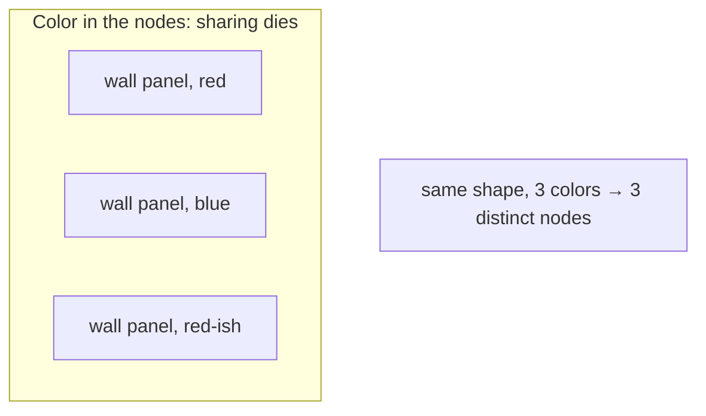
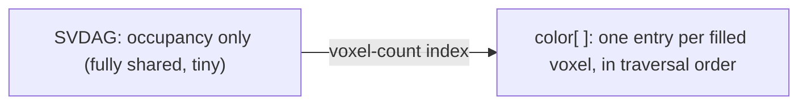
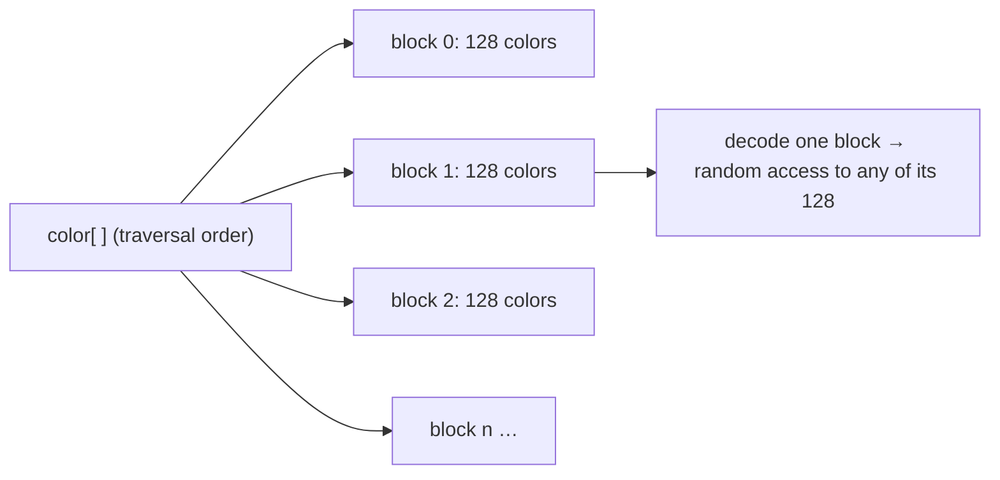
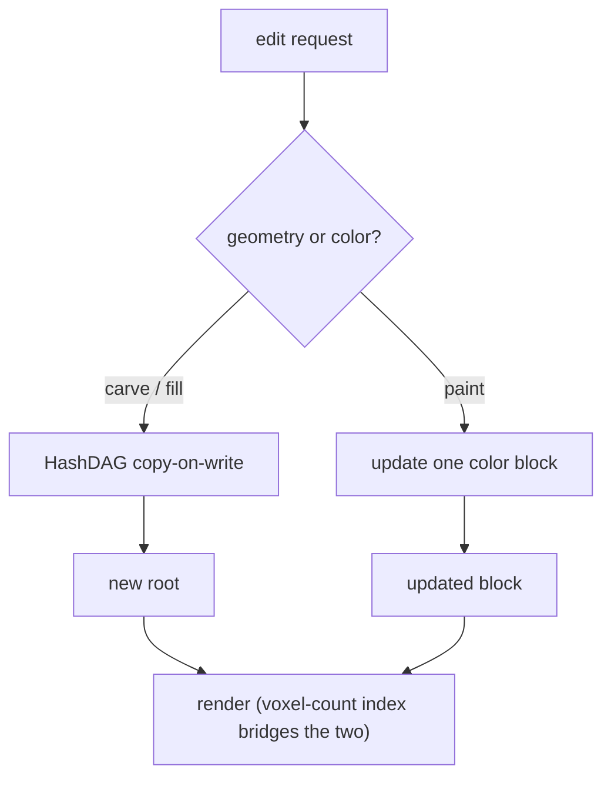

The Sparse Voxel DAG compresses geometry so aggressively that it creates a
second problem, and the second problem is more interesting than the first. Once
you have squeezed a billion-voxel scene into a few hundred megabytes by sharing
identical subtrees, you still have to say what *color* each voxel is, and color,
it turns out, is the thing that fights the sharing hardest. This piece is about
that fight: why you cannot just staple a color onto each voxel, the clean
architectural move that separates color from shape, the almost-free bridge that
reconnects them, and how you compress the color that remains without giving up
the ability to repaint a single voxel in real time.

## Why you cannot just color the nodes

Geometry compresses in a DAG because "identical" is cheap and common. Two nodes
with the same child mask and the same children are the same node, full stop, so
a flat wall collapses into one shared subtree pointed at from everywhere the
wall recurs.

Now attach a color to every voxel and watch that collapse fall apart. Two nodes
that agree perfectly on *occupancy* but disagree on even one voxel's color are,
by the DAG's own rule, different nodes. They cannot be merged. A wall that would
have been one shared subtree becomes as many distinct subtrees as it has color
patches.



It is worth being quantitative about how bad this is. Geometry is
low-entropy: occupancy is one bit, and surfaces repeat, so the DAG finds
enormous redundancy. Per-voxel color is high-entropy: real scenes carry
thousands of distinct colors in a single region, and the variation is dense
enough that *almost every leaf becomes unique* the moment color lives inside it.
Interleave color into the nodes and the DAG quietly degrades back toward the
size of the octree it was built to replace. You paid for a compression scheme
and disabled it with a paintbrush.

## The move: decouple shape from color entirely

The fix is not a cleverer encoding. It is an architectural decision, and it is
the kind of decision that quietly determines everything downstream. Strip color
out of the DAG completely. The DAG stores occupancy and nothing else, and gets
its full two-to-three-orders-of-magnitude compression back. Color goes into a
separate, flat, one-dimensional array, one entry per non-empty voxel, laid out
in the order a depth-first traversal visits those voxels.



Two clean pipelines instead of one tangled one. But separating them raises an
obvious question: standing at a voxel during a ray traversal, how do you find
*its* entry in that flat array? You never stored a per-voxel pointer; that would
have cost more than the color itself.

## The bridge: a 24-bit count that was already free

The answer is one of my favorite little tricks in this whole field, because it
costs almost nothing and reuses space that was lying around unused. Give every
DAG node a count of the non-empty voxels contained in its entire subtree. That
count fits in 24 bits, and those 24 bits come from the padding already sitting
next to the one-byte child mask, so the geometry structure barely grows.

Now the array index is just an accumulation. As a ray descends toward a target
voxel, every time it *skips past* a sibling subtree on the way down, it adds
that subtree's voxel count to a running total. When it arrives at the target,
the running total is exactly the target's index into the color array.

$$
\text{index}(v) = \sum_{s \,\prec\, v} \text{count}(s)
$$

where the sum runs over every subtree $s$ that traversal-order places before the
voxel $v$. This is precisely the "sum of sizes of everything to my left" idea
that powers order-statistics trees, and here it slots into bits that were
otherwise wasted.

```rust
/// Descend to `target`, accumulating the index of its color-array entry.
fn attribute_index(dag: &Dag, target: Voxel) -> u32 {
    let mut node = dag.root;
    let mut index = 0;
    for octant in target.octant_path() {
        // Every occupied sibling before this octant is skipped: add its voxels.
        let mut m = dag.node(node).child_mask & preceding_mask(octant);
        while m != 0 {
            let sib = m.trailing_zeros() as usize;
            index += dag.node(dag.child(node, sib)).voxel_count;
            m &= m - 1;
        }
        node = dag.child(node, octant);
    }
    index
}
```

The overhead of the whole bridge is under 1% of the DAG's storage, and it costs
zero extra memory *bandwidth* during traversal, because you were already reading
those nodes to follow the ray. That last part matters more than it looks: on a
GPU, the scarce resource is not storage, it is cache, and an index that piggybacks
on reads you were already making is as close to free as a design gets.

Once shape and color are separated like this, they can be compressed and, more
importantly, *edited* independently. Repainting a surface writes only into the
color array; the geometric DAG and all the carve-and-fill machinery built on it
never sees the change.

## Compressing the color array itself

Decoupling gives you a plain array, and a plain array of colors is still not
small. For a large edited scene it is a lot of uncompressed bytes. The obvious
move is a general-purpose compressor, and the obvious move fails for a reason
that is the crux of the whole problem: LZ and Huffman compress color beautifully
but destroy *random access*. Editing needs to read and rewrite one voxel's color
in constant time, and you cannot decompress a whole stream to touch a single
entry.

Molenaar and Eisemann (Eurographics 2023) solve this by never compressing the
array as a whole. They compress it in small, independently addressable blocks of
128 consecutive colors, one block per GPU work group, so any single color is
reachable by decoding just its own block.



**The lossless scheme.** Inside each 128-color block, compute the channel-wise
min and max, normalize, and apply Frame-of-Reference encoding, which stores each
color as a small offset from a reference instead of as an absolute value. Then
pick seven to nine reference colors for the block and store every other color as
an index into that little palette using a 128-bit membership mask. Push it to the
theoretical floor and a block bottoms out around

$$
\frac{247 \text{ bits}}{128 \times 24 \text{ bits}} \approx 8.04\%
$$

of the raw size, decoded and updated in constant time per voxel, and it runs on
the GPU.

**The lossy scheme.** Quantize each channel into 8 bins (3 bits per channel)
before applying the same Frame-of-Reference trick on top. You trade a sliver of
color precision, usually imperceptible at the target resolution, for a better
ratio than the lossless path reaches on its own.

```rust
/// Decode one voxel's color from its block. O(1): touches only this block.
fn decode_color(block: &Block, local: usize) -> Rgb {
    let palette_slot = block.membership.rank(local); // which reference color
    let base = block.palette[palette_slot];
    base + block.offsets[local] * block.scale        // Frame-of-Reference
}
```

The property that makes this compatible with editing, and the reason it belongs
in the same story as the HashDAG, is that the array stays compressed *throughout*
an editing session. A repaint touches one 128-color block, decodes it, updates
one entry, re-encodes it, and puts it back. There is never a moment where you
decompress the whole scene, edit, and recompress. The compression is local
enough to survive a paint stroke.

## How it all fits together

Step back and the shape of the pipeline is clean. Geometry edits (carve, fill)
go through the hash-table copy-on-write scheme from the HashDAG piece. Color
edits go through this block-compressed array. Because the two are fully
decoupled, a joint edit (carve part of a shape while repainting the rest) simply
runs both pipelines side by side, and the voxel-count index stays valid the whole
time, because it depends only on occupancy and never on the color values.



What I find satisfying about this design is how the hardest constraint (color
kills sharing) turned into the cleanest architecture (so do not let color near
the sharing). The decoupling is not a workaround grafted on afterward. It is the
load-bearing decision, and the voxel-count index is the quiet 24 bits that let
you pretend the two layers were never apart.
