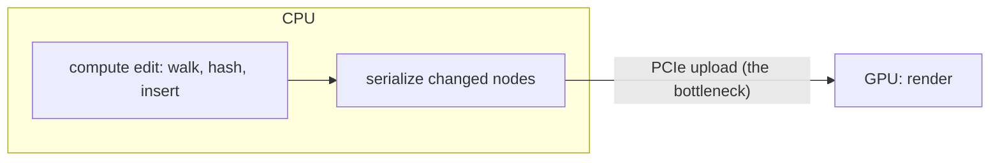
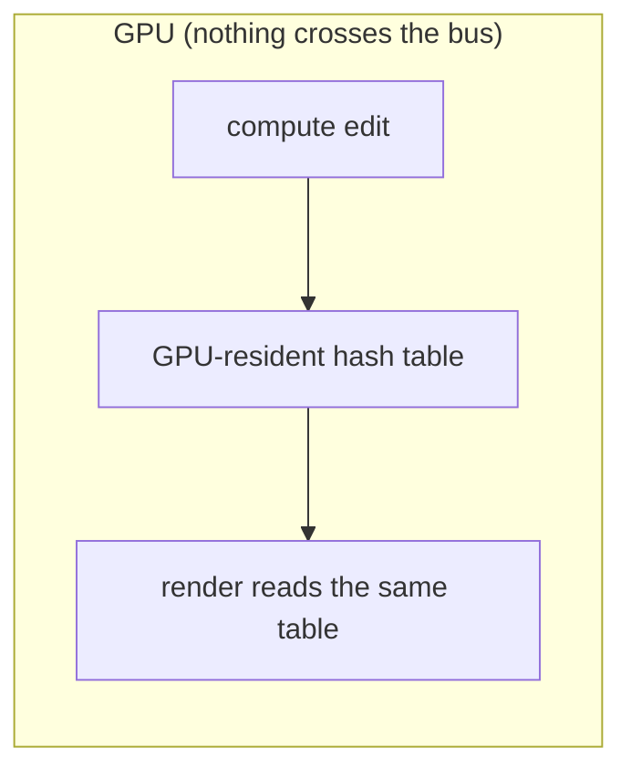
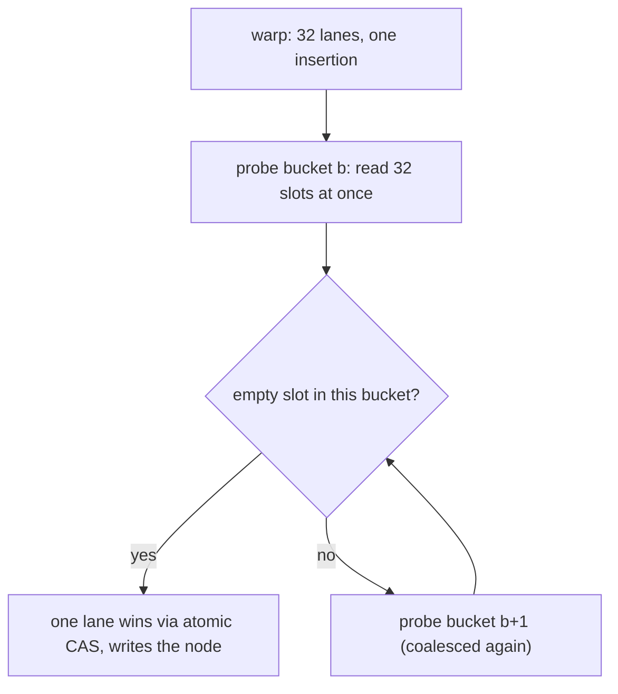
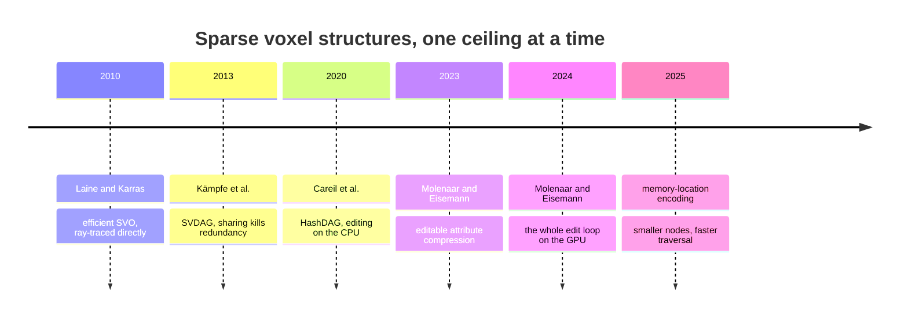

The HashDAG made editing a compressed voxel scene possible, which is a big
deal, and then it left a very specific kind of performance ceiling in place: the
edits run on the CPU, but the scene is rendered by the GPU, so every change has
to cross the bus between the two chips before you can see it. For a small brush
that crossing is invisible. For a large one it is the whole cost. This piece is
about tearing that ceiling out by moving the entire edit pipeline onto the GPU,
and about the genuinely hard problem that move creates: a hash table that
thousands of threads are all trying to write into at the same instant, without
corrupting each other.

## Where the CPU version runs out of room

Recall the shape of a HashDAG edit: walk from the touched voxels up to the root,
minting one new node per level, inserting each into a content-addressed hash
table. On the CPU that is fine for a handful of voxels. The problem is bulk.
Carve a whole building down, or drag a paint brush across a large region, and the
number of touched nodes climbs into the millions. Two things start to hurt at
once.



First, parallelism. A CPU has a few dozen cores; a bulk voxel edit is a few
million independent little hash-table operations. That is a workload the GPU was
built for and the CPU is starved for. Second, and worse, the transfer. Once the
CPU has computed the changed nodes it must ship them across PCIe to the GPU
before the next frame can render them, and for a large edit that upload, not the
computation, becomes the dominant cost. You end up with the CPU doing work it is
bad at and then paying a toll to hand the results to the chip that actually
needed them.

## Moving the whole pipeline onto the GPU

Molenaar and Eisemann's follow-up (submitted around 2024) does the thing the
bottleneck is begging for: it puts the hash table in GPU memory and runs the
edits there too. Insertions and lookups happen in VRAM, rendering reads the same
table in place, and the PCIe upload simply disappears, because nothing has to
move between chips anymore.



Conceptually that is the whole idea, and stated that way it sounds easy. It is
not easy, and the reason is the hash table.

## The hard part: thousands of writers at once

A CPU hash table serves one insertion at a time, or a small handful spread
across cores that rarely collide. A GPU hash table under a bulk edit is a
different animal entirely: a single dispatch can have thousands of threads all
attempting insertions in the same instant, many of them landing in the same
buckets, and not one of them is allowed to clobber another's write. Everything
interesting about the GPU HashDAG is in how it makes that safe *and* fast, and
the two goals pull against each other.

The design has to answer four questions.

**Collision handling.** When two keys want the same bucket, what happens?
Open-addressing schemes (Stadium Hashing, WarpDrive are the ones cited) have a
thread *probe* forward through successive buckets until it finds an empty slot,
rather than chaining collisions into a linked list.

**Warp cooperation.** GPU threads execute in lockstep groups of 32 called warps.
The trick that makes GPU hashing fast is to have an entire warp cooperate on a
*single* insertion or lookup, so that when the warp reads a bucket, all 32 lanes
read 32 adjacent slots in one coalesced memory transaction instead of 32
scattered ones. Memory access is the scarce resource, and coalescing is how you
stop wasting it.



**Concurrency control.** Each bucket holds several slots (32 is typical), guarded
by a bucket-level lock, coarse enough that you are not paying for a lock per slot,
fine enough that unrelated insertions into different buckets never wait on each
other. The winning lane claims an empty slot with an atomic compare-and-swap; the
losers move on.

Here is the shape of it, as an illustrative sketch rather than production
shader code:

```glsl
// One warp cooperates on inserting `key`. Sketch, not literal.
uint warp_insert(uint key, uint node_index) {
    uint bucket = hash(key) % NUM_BUCKETS;
    while (true) {
        uint slot   = bucket * SLOTS + lane_id();   // this lane's slot
        uint occ    = load(table[slot]);            // 32 slots read coalesced
        uint ballot = subgroupBallot(occ == EMPTY); // which lanes see an empty
        if (ballot != 0u) {
            uint winner = findLSB(ballot);           // lowest empty lane wins
            if (lane_id() == winner) {
                // Claim it atomically; retry the bucket if we lost the race.
                if (atomicCompSwap(table[slot], EMPTY, key) != EMPTY) continue;
                table_payload[slot] = node_index;
            }
            return subgroupBroadcast(slot, winner);  // everyone learns the home
        }
        bucket = (bucket + 1u) % NUM_BUCKETS;         // probe onward
    }
}
```

**The alternative, closed addressing.** Slab Hash takes the other road: instead
of probing for an empty slot, collisions grow a linked list of slabs per bucket.
That lets the table grow without a fixed capacity ceiling, at the cost of lookups
becoming linear in however long a particular chain has grown. It is the classic
open-versus-closed trade, now with a warp bolted to each operation.

## The trade-off this version makes with color

Every design in this lineage pays for editing speed somewhere, and the GPU
HashDAG pays with attribute storage. Rather than keep color in the separate,
block-compressed array from the attribute-compression piece, this version stores
a compact material ID, 4 bits per voxel, directly in the DAG leaf. That choice
simplifies editing enormously, because now one GPU-resident structure carries
both occupancy and material and there is nothing to keep in sync across two
pipelines. The cost is a slightly lower compression ratio than the fully
decoupled scheme reaches, since material bits ride along inside the nodes and
reduce how often two nodes are identical. It is a deliberate lean toward edit
simplicity over maximum compression, and for an interactive tool that is often
the right lean.

## What it buys

Large editing operations (bulk carve, bulk fill, real-time 3D painting over big
regions) run at interactive frame rates on the same $128\text{k}^3$ scenes the
earlier papers tested, with the CPU-to-GPU transfer bottleneck gone. The thing
that used to make big edits stutter, the upload, is no longer in the loop at all.

## What is still open

Moving the bottleneck is not the same as closing the subject, and I think the
open problems here are the interesting part.

Garbage collection is the big one. Every edit orphans nodes, and reclaiming the
ones no longer reachable (including from undo history) has to happen eventually,
but doing it concurrently with editing, without a stop-the-world pause, has no
published solution. And everything here still assumes a single writer: one user,
one GPU, one scene. Multiple people editing the same HashDAG at once, with atomic
updates that do not corrupt each other's in-flight insertions, is genuinely
unsolved as of this writing, and it is exactly the sort of problem the
warp-cooperative machinery above hints at without quite answering.

It helps to see where this sits in the arc of the field, because each step took
the previous one's ceiling and pushed it up by one floor:



Read down that column and the pattern is consistent. Someone finds the current
structure's binding constraint, points a well-understood idea at it, and buys
another order of magnitude. Moving editing onto the GPU is one clean step in a
long, still-unfinished line.
