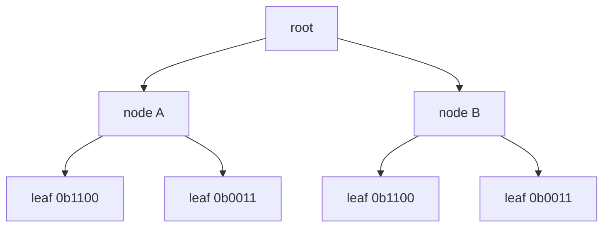
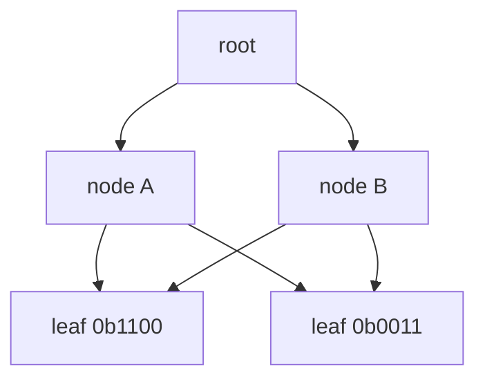
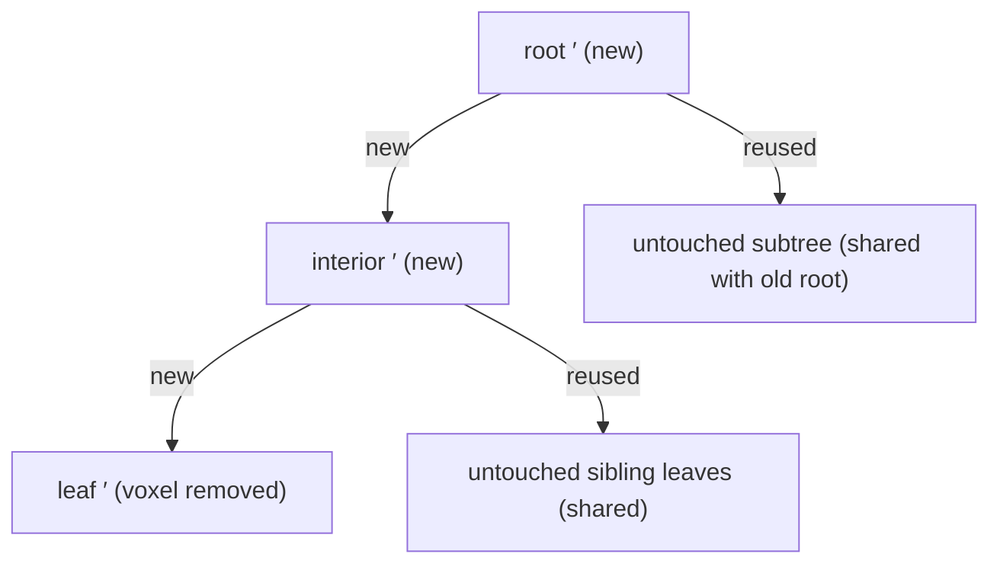
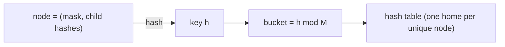

There is a particular kind of data structure I find genuinely beautiful: the
kind where the thing that makes it small is the same thing that makes it hard
to change, so that using it at all becomes a negotiation between two goals that
actively resist each other. The Sparse Voxel DAG is exactly that structure,
and the HashDAG is the negotiation, worked out so cleanly that the first time
I understood it I sat back and grinned. This piece is the build-up and the
payoff: what a voxel scene is, why the DAG compresses it so violently, why
that compression seems to make editing impossible, and the single change of
perspective that makes editing not just possible but interactive.

## Voxels, and the tyranny of the third dimension

A voxel is the boring, honest three-dimensional cousin of a pixel: a value
(occupied or empty, and maybe a color) sitting at a discrete grid position in
space. The trouble with voxels is arithmetic. A 2D image at resolution $N$ has
$N^2$ pixels, which is why a $4096 \times 4096$ texture is merely large. A 3D
grid at resolution $N$ has $N^3$ voxels, and that exponent is a cliff. At
$N = 128\text{k} = 2^{17}$, a dense grid holds

$$
(2^{17})^3 = 2^{51} \approx 2.25 \times 10^{15}
$$

voxels. Two quadrillion cells. Storing even one bit each is hopeless.

The saving grace is that scenes are almost all empty space wrapped around thin
surfaces, and surfaces are two-dimensional. The occupied voxels number more
like $O(N^2)$ than $O(N^3)$. So the entire game is finding a representation
that pays for the surface and pays nothing for the void. That representation
is the octree.

## The Sparse Voxel Octree

An octree recursively cuts a cube into eight equal octants, keeps subdividing
the octants that contain geometry, and simply refuses to store the ones that
are empty. That refusal is the word "sparse," and it is what collapses the
cost from $N^3$ toward $N^2$.

Each interior node needs to record only which of its eight children exist.
That is one bit per octant, so the whole thing fits in a single byte: the
**child mask**.

```text
child_mask = 0b10110101
             │ │  │ │ │
             │ │  │ │ └─ octant 0 occupied
             │ │  │ └─── octant 2 occupied
             │ │  └───── octant 4 occupied
             │ └──────── octant 5 occupied
             └────────── octant 7 occupied
                         (octants 1, 3, 6 are empty)
```

The eight octants are named by three bits, one per axis, which is the whole
reason a byte is the natural size here. Given a point and the node's midpoint,
the child index is three comparisons packed together:

$$
i = 4\,[\,p_z > m_z\,] + 2\,[\,p_y > m_y\,] + [\,p_x > m_x\,]
$$

```rust
fn child_index(p: Vec3, mid: Vec3) -> usize {
    (((p.z > mid.z) as usize) << 2)
        | (((p.y > mid.y) as usize) << 1)
        | ((p.x > mid.x) as usize)
}
```

Two bit tricks show up on every single node access, so they are worth burning
into memory. `count_ones` (popcount) tells you how many children a node has,
which is how many pointers follow the mask. And clearing the lowest set bit,
`mask & (mask - 1)`, lets you walk the occupied octants one at a time:

```rust
// Visit exactly the occupied children, in octant order.
let mut mask = node.child_mask;
while mask != 0 {
    let octant = mask.trailing_zeros() as usize; // lowest occupied octant
    visit(node.child[octant]);
    mask &= mask - 1;                             // clear it, continue
}
```

The octree is compact. It is also, and this is the thing the DAG fixes,
enormously redundant.

## The redundancy nobody talks about

Here is the observation the whole field is built on: real scenes are not made
of unique geometry. A brick wall is one brick tiled a thousand times. A forest
is a handful of tree shapes repeated across a hillside. At the finest scale,
any two flat surfaces facing the same way produce the *identical* leaf pattern,
and any two floors at the same height produce identical subtrees for every
level above the leaves.

An octree knows none of this. It stores every occurrence of every pattern from
scratch, however many thousands of times that pattern recurs. So the tree is
full of subtrees that are bit-for-bit identical and yet stored separately. Draw
a tiny example and the waste is obvious: two interior nodes whose children are
the same two leaves.



Four leaves are stored, but only two are distinct. Now merge the duplicates:
keep one copy of each unique leaf and let both parents point at it.



The tree just became a **directed acyclic graph**: a node can now have several
parents, because identical subtrees are represented once and pointed at from
everywhere they occur. That is the Sparse Voxel DAG, and the construction that
gets you there (Kämpfe, Sintorn, and Assarsson, 2013) is a bottom-up sweep:

1. At the leaf level, find all identical leaves and keep one of each, redirecting
   every pointer to the survivor.
2. Move up a level. After the level below is deduplicated, two nodes are
   identical if and only if their child-pointer lists are identical, which is a
   cheap comparison of a handful of integers rather than a recursive subtree
   walk.
3. Repeat to the root.

The payoff is not subtle. Kämpfe et al. reported two to three orders of
magnitude fewer nodes across every scene they tested. Epic Citadel at
$128\text{k}^3$ (about 19 billion filled voxels) came down from roughly 5.1 GB
as an octree to 945 MB as a DAG. And the counterintuitive part, the part I
love: more complex scenes often compress *better*, because apparent complexity
in a landscape is usually the same rock and the same grass blade repeated at
every scale, and the DAG captures repetition wherever it hides.

Traversal, crucially, does not care that the tree is now a graph. A ray follows
child pointers exactly as before; the fact that a pointer might be shared changes
nothing about how you follow it. The DAG is transparent to the renderer.

## Why editing a DAG feels impossible

Now the antagonism. Compression here *is* sharing, and sharing is precisely
what an edit has to break.

Picture two branches of the scene, A and B, that both point at the same shared
subtree $S$: a wall panel that recurs, say. You want to carve one voxel out of
the copy under A. The correct result is that A points at a new subtree $S'$
(the panel with that voxel gone) while B keeps pointing at the original $S$,
untouched. But $S'$ does not exist yet, and building it is not local. Because
every ancestor's child-pointer list changes when a descendant changes, you have
to rebuild the whole chain from the edited leaf up to the root. This is *path
copying*.



It gets worse. Suppose $S'$ happens to be identical to some subtree that
already exists elsewhere in the scene. The correctly compressed result would
reuse that existing subtree, but finding it means scanning the DAG. Do it
naively and you either duplicate the subtree (inflating the structure a little
more with every edit) or pay a full scan per edit.

The brute-force escape is to give up on staying compressed: decompress the DAG
back to an octree, edit the octree, recompress. It works. It also takes minutes
on a large scene, which rules out anything you would actually want to do,
namely a game, a sculpting tool, or a paint stroke you watch land in real time.

## The move: address a node by its content, not its location

Here is the reframing, from Careil, Billeter, and Eisemann (Eurographics 2020),
and it is one line of insight with enormous consequences. Stop storing the DAG
as a web of pointers between memory locations. Instead, put every node (leaf and
interior alike) into one large **hash table**, keyed on the node's own content:
its child mask together with the hashes of its children.

$$
\text{key}(node) = \operatorname{hash}\bigl(\text{child\_mask},\ h_0, h_1, \dots, h_{k-1}\bigr)
$$

```rust
fn insert(table: &mut HashTable, node: Node) -> Hash {
    let h = hash(node.child_mask, &node.child_hashes);
    if table.contains(h) {
        return h; // an identical node already lives here: nothing to do
    }
    table.insert(h, node);
    h
}
```

Look at what this does. Node identity is now a pure function of content. Two
nodes that happen to have the same shape land in the same bucket automatically,
so deduplication stops being a separate compression pass you run afterward and
becomes a *side effect of insertion*. You can never accidentally store two
copies of the same subtree, because the second insert finds the first and
returns its hash.



That is the property the DAG always wanted and could never quite guarantee
under path copying. Content addressing hands it to you for free.

## Editing becomes copy-on-write

With content addressing, an edit is a short walk from the touched voxel back up
to the root, minting one node per level:

1. Modify the leaf (remove, add, or repaint the target voxel), producing a new
   leaf value.
2. Hash it and insert it. If an identical leaf already exists anywhere in the
   scene, you get its hash back and store nothing new.
3. Rebuild that leaf's parent with the updated child hash, hash *that*, insert
   it. Same deal.
4. Continue to the root. The final root hash is your edited scene.

```rust
/// Carve one voxel; return the hash of the new root.
fn edit_leaf(table: &mut HashTable, path: &[ChildSlot], mut node: Node) -> Hash {
    let mut h = insert(table, node);              // the rebuilt leaf
    for slot in path.iter().rev() {               // walk back up to the root
        let mut parent = table.get(slot.parent).clone();
        parent.child_hashes[slot.octant] = h;     // splice in the new child
        h = insert(table, parent);                // dedup happens right here
    }
    h                                             // new root
}
```

The cost is $O(d)$ insertions per edited leaf, where $d$ is the octree depth.
For a $128\text{k}^3$ scene, $d = \log_2(2^{17}) = 17$, so a single-voxel edit
touches on the order of seventeen nodes. Not seventeen thousand, not a global
rebuild. Seventeen. And if the rebuilt path happens to reproduce nodes that
already exist, they are shared on the spot, with no scan, because the hash
lookup is $O(1)$.

The other gift falls out of the same design. The old root is never modified; it
still resolves to the pre-edit scene, exactly. So undo is a stack of root
hashes, and stepping back in history is a pointer swap rather than a rebuild.
Redo is the same. This is the moment the structure stops feeling like a
compression format and starts feeling like a little version-controlled
filesystem for space.

## What you can actually do with it

The 2020 paper demonstrates four operations, all of them running at interactive
frame rates on $128\text{k}^3$ scenes with tens of millions of voxels touched
per edit:

- **Carve**: remove voxels inside a brush volume.
- **Fill**: add voxels inside a brush volume.
- **Copy**: duplicate a region elsewhere (nearly free, since the copy just
  points at the same shared subtrees).
- **Paint**: change color or material on existing voxels.

The hash table that backs all this is deliberately enormous, allocated up front
through virtual memory so the unused address range costs nothing in physical RAM
until an edit actually writes into it. You reserve a continent and pay only for
the towns you build.

## What it costs, because nothing is free

The antagonism between compression and editing does not vanish. It moves, and
it is worth being honest about where it goes.

Every edit orphans the nodes it replaced. They linger in the table, because
some earlier root in your undo history might still reference them, until a
garbage-collection pass reclaims whatever is no longer reachable. A long editing
session without GC grows the table, which slows lookups and raises memory
pressure. The table itself also carries per-entry overhead (bucket metadata,
collision handling) that a tightly packed pointer array never pays.

There is a subtler cost too, and it is really a *bandwidth* cost. On a GPU the
binding constraint during ray traversal is not VRAM capacity, it is the L2
cache. A ray dereferences $O(\log N)$ nodes in sequence, and every node that
misses the cache stalls the warp for hundreds of cycles waiting on DRAM. A hash
table has less predictable locality than a pointer array, because collision
probing jumps to non-adjacent buckets. In principle that hurts cache behavior.
In practice the editing capability is worth it, and the working set of hot,
frequently-shared nodes is still tiny compared to an octree, so the same sharing
that shrinks storage also keeps the hot set in cache.

## Where it goes from here

Two threads lead directly out of this piece, and each got its own follow-up.

The 2020 HashDAG runs its edits on the CPU and uploads the changed nodes to the
GPU for rendering. For a small brush that transfer is invisible; for a bulk
operation it becomes the bottleneck, which is the story of moving the entire
edit pipeline onto the GPU.

And color has been conspicuously absent here. The original HashDAG stores it
uncompressed alongside geometry, which becomes a memory problem during large
edits, and fixing it means compressing attributes in a way that survives exactly
the copy-on-write update pattern above. That is a lovely problem in its own
right, and it is the subject of the sibling piece on attribute compression.

What I keep coming back to is how little the HashDAG actually invents. Content
addressing is old. Copy-on-write is old. Hash tables are old. The whole thing
is a handful of classical ideas pointed at a spatial problem from the right
angle, and out falls a structure that is both radically compressed and freely
editable, two things that had no business coexisting.
