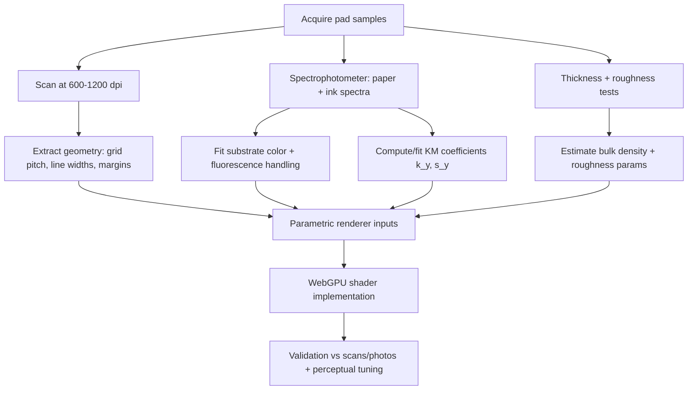
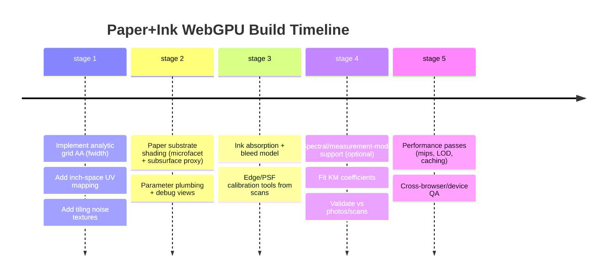

# Physically Based Real-Time Simulation of Paper and Ink for WebGPU

## Executive summary

A physically grounded real-time “paper + ink” renderer is best treated as a **layered optical system**: (a) a **porous, fibrous, highly scattering substrate** (paper) plus (b) a **thin, absorbing, partly penetrating colorant layer** (ink/toner) whose apparent coverage depends on print process and paper–light interaction (dot gain). The core practical insight is that most of the “paper look” comes from **multiple scattering in a low-index-contrast medium (air ↔ cellulose) plus micro-surface roughness**, while most of the “printed ink look” comes from **absorption + lateral light spread inside paper**, not merely drawing crisp lines. citeturn8view1turn2search2turn2search17turn15search2

For a WebGPU target, the fidelity/performance sweet spot is usually a **microfacet surface term** (very rough dielectric) plus a **cheap subsurface / volumetric proxy** driven by **Kubelka–Munk-style coefficients** (or a diffusion approximation) calibrated from measurements. You then render ink as **absorption over path length** with a small, controllable **lateral bleed kernel** whose strength is linked to the substrate scattering regime and the printing process (offset vs inkjet vs laser). This aligns with how paper optics are measured (diffuse reflectance and derived scattering/absorption coefficients; densitometry and spectral measurement modes) and with well-established subsurface approximations used in graphics. citeturn16view0turn8view1turn2search2turn3search6turn24view0

The most rigorous workflow is: **measure** (spectral reflectance, thickness, roughness, porosity proxies) → **fit** (paper scattering/absorption; ink optical density/penetration/bleed) → **validate** (predict reflectance/appearance under multiple illumination/measurement modes; check dot-gain-like behavior) → **optimize** (band-limit noise, use mipmaps/derivatives, and keep grid rendering analytically anti-aliased). The report below lays out concrete models, numeric parameter ranges for a stereotypical green engineering pad, and WebGPU/WGSL implementation recipes. citeturn16view0turn22search0turn24view0turn1search3turn23view0

## Optical and physical properties of paper

Paper is a **turbid, porous, multi-scale structure**: cellulose fibers form an anisotropic network with void space (pores) filled primarily by air; that index mismatch drives strong scattering. In uncoated printing paper, published microstructural measurements include **~150 μm thickness**, **~50% porosity**, and **mean pore size on the order of ~10 μm** (example: 12 μm) with strong in-plane fiber orientation and a “machine direction.” citeturn23view0

### Scattering, absorption, transmission, and thickness

Most “paper whiteness/brightness/opacity” phenomena can be reduced to two bulk optical mechanisms: **scattering** (redistribution of light directions) and **absorption** (loss to heat or conversion, including pigmentation and fluorescence). On the measurement side, the entity["organization","ISO","international standards body"] paper-optics workflow is built around **diffuse reflectance factor / diffuse radiance factor** measurements (integrating-sphere style geometries) and derived metrics like brightness and opacity. citeturn3search3turn3search1turn14search1turn13view0

A widely used reduced-form model for paper optics is the **two-flux** simplification commonly taught via the entity["people","Paul Kubelka","two-flux reflectance theory"]–entity["people","Franz Munk","two-flux reflectance theory"] formulation. In paper-science practice, this is formalized in standards that compute **light-scattering** and **light-absorption** coefficients from reflectance data under specified conditions (geometry, illuminant weighting). citeturn8view1turn16view0turn14search2turn13view0

Under entity["organization","ISO","international standards body"] 9416, the “by reflectance factor measurements” coefficients are expressed as **sᵧ and kᵧ in m²/kg**, computed using luminance-factor data and grammage; the document also notes that strict evaluation requires conditions not fully achieved by routine instruments, and that results depend on the Kubelka–Munk assumptions and the specified d/0° geometry with a gloss trap. citeturn16view0

Typical reported magnitudes (order-of-magnitude guidance) for paper-like stocks are: **scattering (s) tens of m²/kg and absorption (k) typically smaller, often < ~4 m²/kg**, with examples of basestock values around **S ≈ 24 m²/kg and K ≈ 0.8 m²/kg** in illustrative layered-paper calculations. citeturn15search9turn15search11turn13view0

To connect these to rendering-friendly volumetric units, you often convert to a **per-length coefficient** (≈ 1/m or 1/mm) by multiplying by an effective bulk density (because (m²/kg)·(kg/m³)=1/m). Bulk density is not “cellulose density” because paper is porous; cellulose is ~1.5 g/cm³, while paper’s effective density depends on grammage, thickness, and porosity. citeturn17search4turn23view0turn22search0turn16view0

### Refractive index, porosity, and fiber orientation

Cellulose and wood cell-wall constituents are commonly modeled with refractive indices around **n ≈ 1.52–1.54** (representative values used in materials literature), while the pore space is typically air (n≈1.0). That contrast is a major driver of scattering in fibrous media. citeturn1search0turn1search4turn1search12turn23view0

Paper is also anisotropic: fibers predominantly lie in-plane and often align preferentially along the machine direction; this anisotropy can measurably affect directional optical tests and is one reason diffuse measurement geometries are favored when seeking orientation-independent numbers. citeturn23view0turn13view0turn3search6turn3search14

### Surface roughness and the “not-quite-Lambertian” surface

Even “matte” paper has a surface microgeometry that produces (usually weak) **specular reflection** on top of strong diffuse/subsurface scattering. Paper-industry standards define gloss measurement (e.g., 75° gloss) and roughness/smoothness tests designed to simulate print-nip conditions (e.g., Print-surf methods). citeturn14search5turn22search2turn22search13turn13view0

In rendering terms, it is often appropriate to model the surface as a **rough dielectric microfacet layer** sitting over a **subsurface scattering layer**, because purely Lambertian diffuse tends to look too “flat” and misses grazing-angle sheen and localized glare. The subsurface layer is what gives **soft internal light spread** and gentle edge transitions, while the microfacet layer captures viewing-angle-dependent highlights. citeturn2search17turn2search2turn2search5

image_group{"layout":"carousel","aspect_ratio":"16:9","query":["green engineering computation paper 5x5 grid close up","paper fiber microscope image","paper cross section fibers pores SEM","ColorChecker chart photography reference"],"num_per_query":1}

## Ink–paper interaction and printing processes

Ink appearance on paper is governed by **fluid mechanics in porous media** (penetration, spreading, evaporation) plus **optics** (absorption, scattering, fluorescence, and dot gain). A recurring theme in printing research is that “good print” requires **fast enough fluid uptake** to avoid coalescence/bleeding while keeping the colorant distribution near the surface to preserve saturation and gamut. citeturn8view2turn23view0

### Capillary absorption, penetration depth, lateral bleed

Paper can be modeled as a network of capillaries. A classical starting point is the capillary-imbibition relationship known as the entity["people","R. Lucas","capillary imbibition 1918"]–entity["people","E. W. Washburn","capillary imbibition 1921"] equation, widely used (with caveats) to describe penetration dynamics; printing literature also uses extensions such as the entity["people","Charles Bosanquet","capillary inertia 1923"] equation to include inertia, and notes regimes where inertia is small (e.g., sufficiently small pores). citeturn8view2turn0search1turn0search17turn23view0

In coated vs uncoated papers, pore scales differ dramatically: an example coated layer may have **mean pore size ~180 nm and porosity ~34%**, while a comparison uncoated paper may have **mean pore size ~12 μm and porosity ~50%**. These differences strongly affect penetration rate, lateral wicking along fibers, and the risk of “spider-leg” wicking artifacts if liquid reaches the fibrous base. citeturn23view0

### Optical density, pigment vs dye behavior, and the “where the colorant ends up” problem

From an optical standpoint, printed marks are governed by **absorption** (and for fluorescent media, re-emission). In densitometry and graphics technology, optical density is standardized in terms of spectral and geometric measurement conditions (the entity["organization","ISO","international standards body"] 5 series covers spectral conditions; density definitions require specifying measurement conditions). citeturn3search0turn3search5turn24view0

Ink chemistry and dispersion matter: dye-based inks can penetrate with the carrier fluid more easily than pigment particles, and printing studies explicitly discuss the tradeoff: fast penetration reduces bleed/coalescence, but excessive colorant penetration lowers surface color strength and gamut. citeturn8view2turn23view0

### Printing processes and halftone/dot patterns

Different print processes create different “ink layers,” which changes both physical interaction and optical modeling:

**Offset lithography.** Offset presses use high-viscosity inks and transfer ink through roller trains via plate → blanket → paper contact; paper roughness, blanket conformability, and pressure contribute to dot growth. citeturn7search1turn7search9turn7search4

**Inkjet.** Inkjet places discrete droplets (picoliter scale) whose footprint and penetration depend on wetting, pore structure, and evaporation; print-quality discussions use DPI and droplet spacing/diameter (e.g., examples using ~10 μm droplets and spacing consistent with 600–1200 DPI). citeturn7search2turn23view0turn8view2

**Laser / electrophotography.** Laser printing deposits toner particles (polymer + pigment) that are later fused; toner particles are commonly on the order of **several micrometers to ~10 μm** and fusing affects gloss and surface leveling. citeturn7search3turn7search7turn21search11

Most commercial color printing is halftoned. Two principal families are **AM screening** (fixed grid, varying dot size) and **FM/stochastic screening** (fixed dot size, varying dot density), each with distinct texture and artifacts (rosettes vs pseudo-random grain). citeturn6search4turn6search12

A crucial optical effect is **dot gain**, where printed regions appear darker than geometric dot area would suggest. Dot gain has both physical and optical components; optical dot gain arises from **lateral light scattering within the paper** that increases effective absorption path through inked regions. citeturn6search0turn6search5turn15search2

A widely used predictive family for halftone reflectance is the Neugebauer/Yule–Nielsen lineage: spectral Neugebauer models and their Yule–Nielsen modifications can account for paper fluorescence and scattering-driven dot gain; literature surveys show the Yule–Nielsen “n factor” is empirical and depends on paper, ink, and process. citeturn0search2turn6search0turn0search10turn0search6

## Measurement and acquisition methods

A rigorous pipeline distinguishes **geometry/layout capture** (grid pitch, line width, margin offsets), **colorimetric capture** (paper tint, ink spectra), and **material capture** (roughness, scattering/absorption, transmission). The right choice depends on whether you need (a) photorealism under varying illumination, (b) a stable “UI background” look, or (c) process-accurate print simulation.

### Measurement geometry, viewing, and spectral modes

Measurement standards emphasize that results depend on geometry and spectral conditions. In paper optics, diffuse measurements (integrating sphere, d/0°) are commonly used for reflectance-factor based definitions, and standards explicitly tie computed coefficients to specified instrument geometry and calibration. citeturn16view0turn3search6turn13view0

In graphic technology color measurement, the measurement condition matters especially when papers contain optical brightening agents (OBAs) because UV content changes apparent brightness/whiteness. The entity["organization","CIE","international commission on illumination"] illuminant basis and measurement modes (M0/M1/M2/M3) are discussed in ISO-linked practice; “M1 ~ D50” and UV-cut modes materially change readings for fluorescent papers, while for papers without OBA the influence is much smaller. citeturn24view0turn14search1

For instrument examples, the entity["company","Konica Minolta","measurement instruments company"] FD-7/FD-5 documentation and product literature describe support for ISO 13655 measurement conditions; similarly, entity["company","X-Rite","color measurement company"] spectrophotometer spec sheets commonly state visible spectral ranges and sampling/resolution appropriate for reflectance curves used in fitting. citeturn5search5turn5search9turn5search0

### Practical acquisition tools

**Flatbed scanning** is the most accessible way to capture border geometry, grid widths, and a first-pass paper/ink color. However, scanners are not intrinsically “colorimetric,” so you should treat them as devices needing profiling if you want numeric stability.

A standard approach is to calibrate/profile a scanner using reflective or transmissive targets standardized under entity["organization","ISO","international standards body"] 12641 (IT8 targets), then scan paper samples under repeatable settings (fixed exposure, no auto-enhancement). citeturn5search3turn5search15turn5search7

**Spectrophotometry** yields spectral reflectance curves that are far more robust than RGB captures; these curves are the natural input for Kubelka–Munk fits and for spectral halftone models (Neugebauer-family). citeturn16view0turn0search2turn5search0

**Gonioreflectometry / BRDF measurement** is the most rigorous way to get the (small) directional component of paper reflection; published instruments for BRDF measurement in graphics and optical engineering show how samples can be measured over angular domains. For paper backgrounds, you can often approximate instead of measuring a full BRDF, but the method exists if you need it. citeturn2search11turn2search7

**Thickness, roughness, and porosity proxies** are measured via established paper test standards: thickness (caliper) via ISO 534; roughness via ISO 8791-4 (Print-surf) and related air-leak methods; air permeance via ISO 5636 variants (Bendtsen). These are useful because they correlate with print behavior and surface appearance even when you can’t image microstructure directly. citeturn22search0turn22search2turn22search6turn23view0

### Concrete measurement protocol for a physical engineering pad

The following protocol is designed so you can reproduce a pad as a parameterized shader/material, not just a bitmap.

**Sample preparation.** Condition paper in a standard indoor environment and avoid creases; for optical testing, avoid fingerprints (oil changes gloss/absorption). citeturn16view0turn22search0

**Layout capture (borders, grid pitch, line widths).**
1. Scan at **≥600 dpi** (preferably 1200 dpi if you want fiber/ink edge statistics) in 16-bit per channel if available, with all auto features disabled (sharpening, dust removal, auto-contrast).
2. Measure pixel distances for: page width/height, border offsets, thin-line width, heavy-line width.
3. Convert px → inches via scanner DPI, then sanity-check against known grid pitch (engineering pads are commonly 5 squares/inch → 0.2"). citeturn4search3turn4search4turn18search6

**Color + spectral capture (paper tint and grid ink).**
1. Measure spectral reflectance of (a) unprinted paper, (b) grid ink region, (c) any heavier border ink using a spectrophotometer supporting appropriate measurement conditions (ideally D50/M1 if you want print-industry comparability; add UV-cut measurements if fluorescence is suspected). citeturn24view0turn5search5turn0search3
2. Record measurement geometry and backing, since standards warn that computed coefficients depend on these conditions. citeturn16view0turn3search6

**Optical coefficient fitting (paper scattering/absorption).**
1. Measure reflectance over black backing and intrinsic reflectance (thick stack) as required by ISO 9416-style computation (or equivalent measurement set).
2. Compute (or invert-fit) kᵧ and sᵧ; store in m²/kg, then convert to per-length coefficients via effective bulk density (from grammage and thickness). citeturn16view0turn22search0turn23view0

**Texture/roughness capture.**
1. Measure surface roughness using Print-surf (ISO 8791-4) if you have lab access; otherwise estimate roughness amplitude statistically from high-resolution scans + raking-light photography (a proxy, not a standard). citeturn22search2turn22search13

**Ink spread characterization (to set bleed parameters).**
1. Photograph or scan a deliberately drawn “ink test pattern” (thin lines, dots, corners) using the exact pen/pencil you want to emulate.
2. Compute edge spread (MTF/PSF) from those patterns (even a simple 1D edge spread function is useful), because paper lateral scattering is a key driver of apparent edge softness and dot gain. citeturn15search2turn6search0

Suggested mermaid pipeline diagram:



## Mathematical models and rendering-fidelity ladder

The key modeling challenge is choosing a representation that (a) respects physics/measurement, (b) is steerable by parameters, and (c) is fast enough for a WebGPU background shader.

### Substrate optics: from radiative transfer to real time

**Radiative transfer and two-flux reductions.** Paper-physics references describe Kubelka–Munk as a two-flux simplification of radiative transfer for turbid media, noting regimes where it works well (diffuse illumination, strong scattering, “dull” materials) and limitations (e.g., poor for collimated illumination; transmittance errors in certain K/S regimes). citeturn8view1turn16view0

**Kubelka–Munk coefficients as a practical parameterization.** In industry standards, kᵧ and sᵧ (m²/kg) become a compact description of substrate scattering and absorption under defined conditions and are directly connected to measured reflectance factors. This is attractive for real time because you can drive a shader with a small parameter set that is nonetheless traceable to measurement. citeturn16view0turn14search2turn13view0

**Diffusion approximation and BSSRDF.** In graphics, subsurface scattering is frequently approximated by diffusion-like models whose surface form is a BSSRDF (bidirectional surface scattering reflectance distribution function). This is the right conceptual bucket for “paper glow” and soft internal spread, especially because paper is highly scattering. citeturn2search2turn2search17turn2search5

A useful hybrid is: microfacet surface BRDF + a low-cost subsurface term approximating diffusion, with diffusion length controlled by converted scattering/absorption coefficients. This echoes the “efficient translucent material” literature and the classic, practical subsurface model popular in rendering. citeturn2search2turn2search5turn2search17

### Ink optics and dot gain: absorption + lateral spread

**Optical density and absorption.** Densitometry standards define optical density in terms of modulation of radiant flux and require specifying spectral conditions. In rendering, you’ll typically use Beer–Lambert-like attenuation through an “effective ink thickness” or “effective absorption coefficient,” then modulate that by penetration and dot gain proxies. citeturn3search0turn3search5turn24view0

**Dot gain as a PSF problem.** Several printing and optics references interpret Yule–Nielsen-like behavior as a consequence of lateral light scattering—effectively a point-spread function in paper that couples inked and uninked regions. Literature discussing lateral scattering in paper and the physics behind Yule–Nielsen supports treating dot gain as an optical spread phenomenon, not purely geometric dot growth. citeturn15search2turn6search0turn6search6

### Porous-media dynamics: capillarity, penetration, and bleed

Fluid uptake is often modeled via capillary imbibition laws (Lucas–Washburn family), sometimes augmented for inertia or complex pore networks; published work in printing specifically applies these relationships to inkjet droplets on paper and discusses dependence on porosity, roughness, and sizing. citeturn8view2turn23view0turn0search1

For real-time rendering, you usually don’t simulate the full transient fluid problem. Instead you build a **parameterized ink-footprint model**:
- **Penetration depth** controls how much colorant remains near the surface (affecting saturation).
- **Lateral bleed** controls edge softness and line thickening.
- **Time** can be a purely artistic driver (drying animation) or be linked to Lucas–Washburn scaling if you want physically motivated dynamics. citeturn8view2turn0search1turn23view0

## WebGPU and WGSL implementation recipes

This section emphasizes techniques that (a) are physically motivated, (b) behave well under scrolling/zoom, and (c) are implementable in WGSL without pathological aliasing.

### Derivatives and anti-aliasing requirements

Analytic grid rendering and thin ink strokes will shimmer unless anti-aliased in a derivative-aware way. WGSL provides screen-space derivatives and fwidth-style helpers; the spec and reference material warn that derivative builtins return indeterminate values in non-uniform control flow, so structure shaders to keep derivative usage uniform across a quad. citeturn1search3turn1search11turn1search15

### Shader recipe: paper substrate (microfacet + subsurface proxy)

Conceptual steps:
1. Compute base paper albedo (green tint) in linear space.
2. Layer low-frequency “pulp” variation and mid/high-frequency “fiber” variation (band-limited).
3. Compute a subtle microfacet specular term (dielectric F0 consistent with a cellulose-like index regime) and a diffuse/subsurface term whose spread/strength is linked to scattering/absorption parameters. citeturn2search17turn2search2turn16view0turn1search0

WGSL-style pseudocode (sketch; you will adapt to your pipeline):

```wgsl
// Inputs (uniforms)
struct PaperParams {
  page_size_in      : vec2f;   // (8.5, 11.0)
  grams_per_m2      : f32;     // grammage
  thickness_m       : f32;     // paper thickness in meters
  s_y_m2_per_kg     : f32;     // KM scattering coefficient
  k_y_m2_per_kg     : f32;     // KM absorption coefficient
  paper_tint_linear : vec3f;   // base albedo (linear)
  roughness         : f32;     // microfacet roughness
};

// Convert KM (m^2/kg) to per-length (1/m) via bulk density approximation
fn km_to_mu(params: PaperParams) -> vec2f {
  let rho = (params.grams_per_m2 / 1000.0) / params.thickness_m; // kg/m^3
  let mu_s = params.s_y_m2_per_kg * rho; // 1/m
  let mu_a = params.k_y_m2_per_kg * rho; // 1/m
  return vec2f(mu_s, mu_a);
}

// Band-limited noise sampling (recommend using a mipmapped noise texture)
fn paper_albedo(uv: vec2f, tint: vec3f, noiseTex: texture_2d<f32>, samp: sampler) -> vec3f {
  // low frequency mottling
  let n0 = textureSample(noiseTex, samp, uv * 0.5).r;
  // mid frequency fiber density
  let n1 = textureSample(noiseTex, samp, uv * 4.0).r;
  // high frequency micro-variation (should be very subtle)
  let n2 = textureSample(noiseTex, samp, uv * 32.0).r;

  let pulp = 0.02 * (n0 - 0.5);
  let fiber = 0.03 * (n1 - 0.5) + 0.01 * (n2 - 0.5);

  return tint * (1.0 + pulp + fiber);
}

// Very cheap "subsurface proxy": increase diffuse and add a soft wrap term
fn subsurface_proxy(N: vec3f, V: vec3f, L: vec3f, mu_s: f32, mu_a: f32) -> f32 {
  let ndotl = max(dot(N, L), 0.0);
  // diffusion length ~ 1/sqrt(3*mu_a*(mu_a+mu_s')) (common diffusion proxy)
  // Here just map coefficients to a softness scalar.
  let softness = clamp(0.2 + 0.8 * (mu_s / (mu_s + mu_a + 1e-6)), 0.0, 1.0);
  let wrap = clamp((ndotl + softness) / (1.0 + softness), 0.0, 1.0);
  return wrap;
}
```

The diffusion-length relationship above is widely used in diffusion approximations in optics/graphics, and the BSSRDF framing is a standard way to reason about subsurface transport. citeturn2search2turn2search17turn15search8

### Shader recipe: procedural fiber normal generation (anisotropic micro-normals)

Paper fibers imply anisotropy (machine direction). You can fake this with an **anisotropic noise field** and derive normals from a height function. If you don’t band-limit, you will alias; for real time, prefer a precomputed, tileable noise texture with mipmaps and sample it at controlled frequencies. citeturn23view0turn1search11turn1search3

```wgsl
fn fiber_normal(
  uv: vec2f,
  md_dir: vec2f,           // machine direction in UV
  noiseTex: texture_2d<f32>,
  samp: sampler
) -> vec3f {
  // Build an oriented coordinate system
  let t = normalize(md_dir);
  let b = vec2f(-t.y, t.x);

  // Sample along oriented axes to create "stretched" fibers
  let u = dot(uv, t);
  let v = dot(uv, b);

  // Height field: low amplitude, anisotropic
  let h0 = textureSample(noiseTex, samp, vec2f(u * 40.0, v * 6.0)).r;
  let h1 = textureSample(noiseTex, samp, vec2f(u * 120.0, v * 14.0)).r;
  let height = 0.6*h0 + 0.4*h1;

  // Screen-space derivatives for stable normal estimation
  let dhdx = dpdx(height);
  let dhdy = dpdy(height);

  // Build normal; scale is tiny for paper
  let scale = 0.03;
  let n = normalize(vec3f(-dhdx * scale, -dhdy * scale, 1.0));
  return n;
}
```

WGSL derivative functions and their constraints are specified in the WGSL documentation; keep derivative calls out of divergent control flow. citeturn1search3turn1search11turn1search15

### Shader recipe: ink absorption + bleed (capillarity-inspired)

A physically motivated model treats printed ink as a **thin absorbing layer** whose effective thickness varies spatially due to penetration and lateral bleed. Paper studies describe capillary absorption into porous networks and discuss how penetration and diffusion/evaporation can affect results; this supports modeling bleed with a time/parameter-driven widening and softening term. citeturn8view2turn0search1turn23view0

```wgsl
// Ink parameters
struct InkParams {
  ink_rgb_linear : vec3f;  // intrinsic ink color (linear)
  od             : f32;    // optical density proxy (dimensionless)
  bleed_mm       : f32;    // lateral bleed radius (mm)
  pen_depth_um   : f32;    // penetration depth (um), affects saturation
};

// Convert OD-like control into absorption factor
fn ink_absorb(od: f32) -> f32 {
  // OD ~ log10(I0/I); convert to an exponential attenuation proxy
  // k = ln(10) * OD
  return 2.3025851 * od;
}

// Approximate bleed: sample an ink coverage mask with a small blur kernel.
// In practice, do this in a lower-res pass or via mip bias.
fn ink_coverage_with_bleed(
  uv: vec2f,
  inkMask: texture_2d<f32>,
  samp: sampler,
  bleed_uv: vec2f
) -> f32 {
  let c0 = textureSample(inkMask, samp, uv).r;
  let c1 = textureSample(inkMask, samp, uv + vec2f( bleed_uv.x, 0.0)).r;
  let c2 = textureSample(inkMask, samp, uv + vec2f(-bleed_uv.x, 0.0)).r;
  let c3 = textureSample(inkMask, samp, uv + vec2f(0.0,  bleed_uv.y)).r;
  let c4 = textureSample(inkMask, samp, uv + vec2f(0.0, -bleed_uv.y)).r;
  return (c0*4.0 + c1 + c2 + c3 + c4) / 8.0;
}

fn apply_ink_over_paper(
  paper_rgb: vec3f,
  coverage: f32,
  ink: InkParams
) -> vec3f {
  let k = ink_absorb(ink.od);

  // Penetration reduces apparent saturation: push ink toward paper color
  let penetration = clamp(ink.pen_depth_um / 50.0, 0.0, 1.0);
  let apparent_ink = mix(ink.ink_rgb_linear, paper_rgb, penetration);

  // Beer-like attenuation controlled by coverage
  let a = 1.0 - exp(-k * coverage);
  return mix(paper_rgb, apparent_ink, a);
}
```

This is not a full porous-media solver, but it is consistent with the observed need to control penetration depth vs surface color and with the capillary absorption framing used in printing research. citeturn8view2turn23view0turn3search0

### Shader recipe: analytically anti-aliased grid rendering

Engineering pads are typically “5 squares per inch” grids. Draw lines analytically in UV/inch space and anti-alias with fwidth so the grid remains stable under zoom/scroll. Product descriptions for common engineering pads explicitly specify 5 squares/inch and “ruling printed on back that shows through,” matching this analytic approach. citeturn4search3turn4search4turn1search11

```wgsl
fn aa_step(edge: f32, x: f32) -> f32 {
  let w = fwidth(x);
  return smoothstep(edge - w, edge + w, x);
}

// Returns 1.0 inside a grid line, 0.0 outside
fn grid_line(uv_inch: vec2f, pitch_in: f32, line_w_in: f32) -> f32 {
  let gx = abs(fract(uv_inch.x / pitch_in) - 0.5) * pitch_in;
  let gy = abs(fract(uv_inch.y / pitch_in) - 0.5) * pitch_in;
  let d = min(gx, gy); // distance to nearest grid line center in inches

  // AA line: inside when d < line_w/2
  let halfw = 0.5 * line_w_in;
  // Use smoothstep with fwidth expressed in same units:
  let fw = fwidth(d);
  return 1.0 - smoothstep(halfw - fw, halfw + fw, d);
}

fn major_grid(uv_inch: vec2f, small_pitch: f32) -> f32 {
  // major every 5 small squares => 1 inch if small_pitch = 0.2"
  return grid_line(uv_inch, small_pitch * 5.0, 0.012); // example width in inches
}
```

Derivatives and fwidth are defined in WGSL; for correctness and portability you must keep derivative use out of divergent branches. citeturn1search3turn1search11turn1search15

## Parameter set for a stereotypical green-tint engineering pad

This table provides a **recommended starting parameterization** with plausible numeric ranges and explicit units. Where the literature supports a numeric range, a citation is included; otherwise the entry is marked as “measure from pad,” because border offsets, ink line widths, and exact tint are commonly vendor/batch dependent. citeturn4search3turn4search0turn16view0turn23view0

| Dimension | Parameter (units) | Recommended range for “classic” pad | Notes / how to measure |
|---|---:|---:|---|
| Page geometry | Page size (in) | 8.5 × 11 | Typical engineering computation pad size. citeturn4search3turn4search4turn4search0 |
| Grid geometry | Grid pitch (in) | 0.2 (5/in) | Common “5×5” ruling. citeturn4search3turn4search4 |
| Grid hierarchy | Major pitch (in) | 1.0 (every 5) | Often 5×5 squares per inch with heavier 1-inch lines; verify visually. citeturn4search3 |
| Border layout | Frame offsets (in) | Measure from pad | Scan and measure in pixels; convert via DPI. (Not typically published.) |
| Paper mass | Grammage (g/m²) | ~60 (for 16 lb bond) | Paper calculators commonly map 16 lb bond to ~60 gsm; verify for your SKU. citeturn18search6turn4search2 |
| Paper thickness | Thickness (μm) | ~60–120 | Thickness is measured via ISO 534; office papers are often in this order of magnitude; measure your pad. citeturn22search0turn1search5 |
| Bulk density | ρ_bulk (kg/m³) | ~500–1000 | Compute from grammage/thickness; used to convert KM (m²/kg) to 1/m. citeturn16view0turn22search0 |
| Porosity | φ (0–1) | ~0.3–0.6 | Uncoated example paper: ~0.50; green-tint bond likely similar order. citeturn23view0 |
| Mean pore size | d_pore (μm) | ~5–20 (uncoated) | Example uncoated printing paper: mean pore size ~12 μm; coated layers are orders smaller. citeturn23view0 |
| Refractive index | n_cellulose (—) | ~1.52–1.54 | Representative cellulose/wood template index values used in materials literature. citeturn1search0turn1search12turn1search4 |
| Paper scattering | sᵧ (m²/kg) | ~20–60 | Reported examples include S≈24 m²/kg basestock and “typical” S > ~40 m²/kg in summaries; measure for your pad. citeturn15search11turn15search9turn16view0 |
| Paper absorption | kᵧ (m²/kg) | ~0.2–2 (tinted) | Summaries report k typically smaller than scattering and often < ~4 m²/kg; green tint raises k vs white. citeturn15search9turn15search11turn16view0 |
| Converted scattering | μ_s ≈ ρ·sᵧ (1/mm) | ~10–50 | With ρ_bulk ~500–1000 kg/m³ and sᵧ ~20–60 m²/kg you get tens per mm; tune to match edge spread/dot gain. citeturn16view0turn23view0 |
| Converted absorption | μ_a ≈ ρ·kᵧ (1/mm) | ~0.2–5 | Depends strongly on tint/OBAs; fit from spectra. citeturn16view0turn24view0 |
| Surface gloss | 75° gloss (GU) | Low (matte) | If you can measure, ISO 8254-1 defines the method; otherwise use high roughness microfacet. citeturn14search5turn21search6 |
| Microfacet roughness | α (—) | ~0.4–0.9 | Rendering parameter (not directly GU); calibrate by matching highlight visibility. citeturn2search17turn2search5 |
| Ink optical density | OD (—) | ~0.05–0.3 (faint grid) | OD is process/ink dependent; densitometry standards define conditions; measure reflectance of ruled line vs paper. citeturn3search0turn24view0turn4search3 |
| Ink penetration depth | d_pen (μm) | ~1–50 (process dependent) | Highly dependent on ink type and paper; inkjet studies discuss penetration/quality tradeoffs. citeturn8view2turn23view0 |
| Lateral bleed radius | r_bleed (μm) | ~5–200 | Calibrate from scanned edge spread; relates to lateral scattering/dot gain. citeturn15search2turn6search0 |

Parameters that remain “must-measure” for a faithful replica of a specific pad SKU: **frame offsets**, **exact paper tint spectrum**, **exact grid ink spectrum**, **line widths**, **presence/absence of fluorescence**, and your desired **“writing instrument”** (pencil vs pen) interaction map. Product listings typically describe “green tint paper” and “green ink,” but do not provide colorimetric coordinates or line-offset dimensions. citeturn4search0turn4search3turn4search4

## Validation, calibration, and performance checklist

### Calibration and validation workflow

A rigorous validation plan compares the renderer against measurements under the same conditions used to derive parameters:

1. **Spectral match (paper and ink).** Fit paper tint and ink absorption so that simulated reflectance curves match measured curves; treat fluorescence explicitly (or force UV-cut) because measurement mode differences can be dramatic with OBAs. citeturn24view0turn16view0turn0search2  
2. **Reflectance-factor reproduction.** Check the simulated analogs of “single-sheet over black” and “intrinsic reflectance” because ISO 9416-style coefficients are defined from those quantities and a specified geometry. citeturn16view0turn13view0  
3. **Edge spread / dot gain behavior.** Validate that small dots/lines darken and thicken in a way consistent with lateral scattering; treat this as PSF/MTF matching using scanned test patterns (a practical proxy for dot gain). citeturn15search2turn6search0turn6search5  
4. **Angle response sanity check.** If your background is meant to respond to “lighting,” validate at least qualitatively against paper gloss/roughness standards (paper is mostly diffuse, low gloss for uncoated). citeturn14search5turn22search2turn2search5  

### WebGPU performance optimization checklist

Use this as a “keep it real-time and stable” guardrail:

**Band-limit everything.** High-frequency procedural noise without mipmapping will shimmer; prefer tileable noise textures with mipmaps, or sample procedural noise only at frequencies that remain above pixel footprint. citeturn1search11turn1search3  

**Analytic AA for lines.** Render grid lines via distance-to-line and smoothstep with fwidth; avoid rasterizing millions of thin quads/lines. citeturn1search11turn1search3  

**Derivative safety.** Keep dpdx/dpdy/fwidth out of divergent control flow; compute mask distances first, branch later if needed. WGSL explicitly constrains derivatives in non-uniform flow. citeturn1search3turn1search11turn1search15  

**Two-pass where it matters.** If you want ink bleed that looks like a blur kernel, consider a small offscreen pass at reduced resolution (or exploit mip bias) rather than many taps at full res.

**Texture formats.** Store albedo/ink in sRGB where appropriate but perform shading in linear; store scalar noise/roughness in single-channel formats; ensure mipmaps exist for any texture sampled at multiple scales.

**Tiling strategy.** Make the substrate noise tile at a large period (e.g., multiple pages) and use multiple octaves to avoid repetition. Keep the grid analytic and anchor UV in “inches space” so scroll/zoom remains stable.

**Avoid per-pixel heavy math.** If you choose a diffusion-like subsurface proxy, keep it algebraic (no loops, no expensive transcendental cascades). Reserve expensive operations for rare effects.

**Validation budget.** Build a debug mode that outputs intermediate scalar fields (coverage, bleed radius, μ_s/μ_a scalars) so you can quickly tune to match scans/spectra.

### Prioritized bibliography with URLs

The list below emphasizes primary sources (standards and peer-reviewed papers) first, then measurement device documentation and practical references.

```text
Tier 1: Paper optics + standards (primary)
- ISO 9416:2017 Paper — Determination of light scattering and absorption coefficients (Kubelka–Munk)
  https://cdn.standards.iteh.ai/samples/69093/e6876d9e51bb405791fc863f1adc1dec/ISO-9416-2017.pdf
- ISO 2469:2024 Paper, board and pulps — Measurement of diffuse radiance factor (diffuse reflectance factor)
  https://cdn.standards.iteh.ai/samples/81655/1b8fd4cf72c840f8b4c96a25cf384aab/ISO-2469-2024.pdf
- ISO 13655 (abstract page; measurement conditions referenced widely in print colorimetry)
  https://www.iso.org/obp/ui/en/
- ISO 2471:2008 Opacity (paper backing) — diffuse reflectance method (abstract page)
  https://www.iso.org/standard/39771.html
- ISO 534:2011 Paper and board — Determination of thickness, density and specific volume
  https://www.iso.org/standard/53060.html
- ISO 8791-4:2021 Paper and board — Roughness/smoothness (Print-surf method)
  https://cdn.standards.iteh.ai/samples/76350/25d7b2fb31d541a88654fee10c89ebb3/ISO-8791-4-2021.pdf

Tier 1: Peer-reviewed paper science (primary)
- Farnood, “Optical Properties of Paper: Theory and Practice” (Fundamental Research Symposium, 2009)
  https://bioresources.cnr.ncsu.edu/wp-content/uploads/2019/04/2009.1.273.pdf
- Hubbe et al., “Paper’s appearance: A review” (BioResources, 2008)
  https://bioresources.cnr.ncsu.edu/BioRes_03/BioRes_03_2_0627_Hubbe_PK_PapersAppearance_Review.pdf
- Aslannejad et al., “Characterization of the Interface Between Coating and Fibrous Layers of Paper” (2018, PMC)
  https://pmc.ncbi.nlm.nih.gov/articles/PMC6394735/
- Lundberg et al., “Microscale droplet absorption into paper for inkjet printing” (2011)
  https://www.diva-portal.org/smash/get/diva2:400784/FULLTEXT02.pdf
- Coppel et al., “Lateral light scattering in paper” (Optics Express, 2011) (abstract page)
  https://opg.optica.org/abstract.cfm?uri=oe-19-25-25181
- Beuc et al., “Monte Carlo Modeling of Light Scattering in Paper” (JIST, PDF)
  https://library.imaging.org/admin/apis/public/api/ist/website/downloadArticle/jist/53/2/art00002

Tier 1: Halftone/dot gain optics (primary)
- “The Physics Behind the Yule-Nielsen Equation” (IS&T, 1999)
  https://www.imaging.org/common/uploaded%20files/pdfs/Papers/1999/PICS-0-42/1065.pdf
- Hersch, “Spectral Neugebauer-based color halftone prediction model accounting for paper fluorescence” (Applied Optics, 2014) (abstract page)
  https://opg.optica.org/ao/abstract.cfm?uri=ao-53-24-5380
- Urban & Rosen, “Inverting the Cellular Yule-Nielsen modified Spectral Neugebauer Model” (2007, PDF)
  https://www.imaging.org/common/uploaded%20files/pdfs/Papers/2007/MCS-0-915/44078.pdf

Tier 1: Subsurface rendering models (primary graphics)
- “A Practical Model for Subsurface Light Transport” (SIGGRAPH 2001, PDF)
  https://ii.uni.wroc.pl/~anl/dyd/seminarium/2001_zima/jensen-apm.pdf
- PBRT (BSSRDF chapter)
  https://www.pbr-book.org/3ed-2018/Volume_Scattering/The_BSSRDF

Tier 2: Measurement devices + measurement-mode guidance
- i1Pro 3 spec sheet (spectral range/resolution)
  https://www.xrite.com/-/media/xrite/files/literature/l7/l7-700_l7-799/l7-718-i1pro-3-spec-sheet/l7-718_i1pro3_spec-sheet_en.pdf
- Konica Minolta FD-7/FD-5 catalog / measurement modes
  https://sensing.konicaminolta.us/wp-content/uploads/fd-7_5_catalog-9d7cy681x9.pdf
- Cheydleur deck explaining ISO 13655 measurement modes and OBA effects
  https://www.color.org/events/prague/7.Cheydleur.pdf

Tier 2: WebGPU/WGSL (implementation)
- WGSL Spec (derivatives, texture sampling, rules)
  https://www.w3.org/TR/WGSL/
- Derivative function reference (dpdx/dpdy/fwidth summaries)
  https://webgpufundamentals.org/webgpu/lessons/webgpu-wgsl-function-reference.html
```

### Suggested mermaid “implementation timeline” diagram



